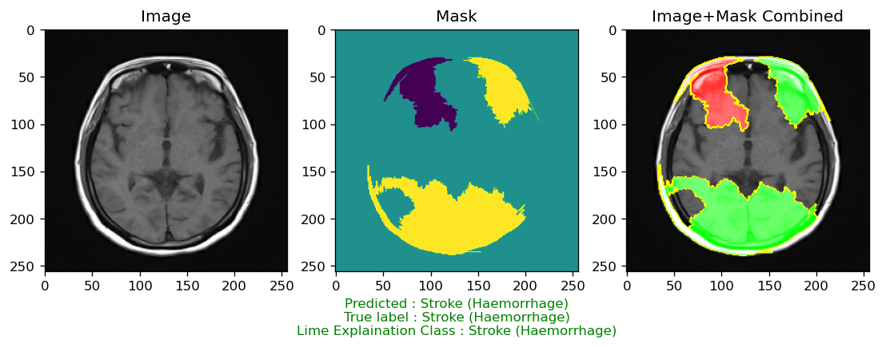
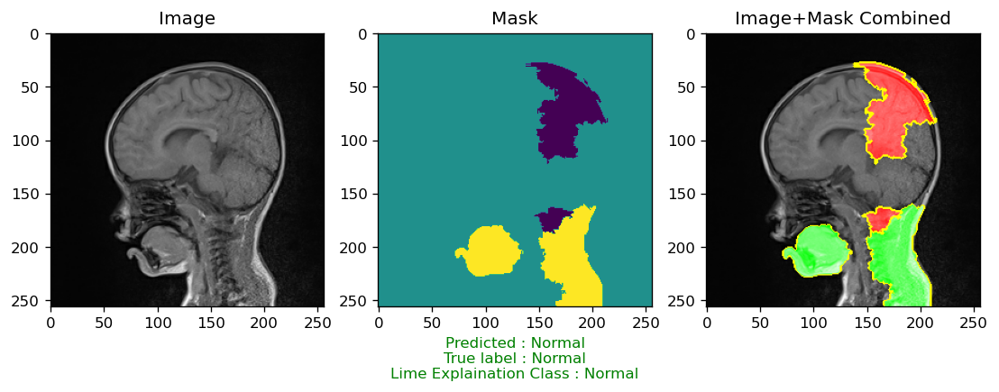
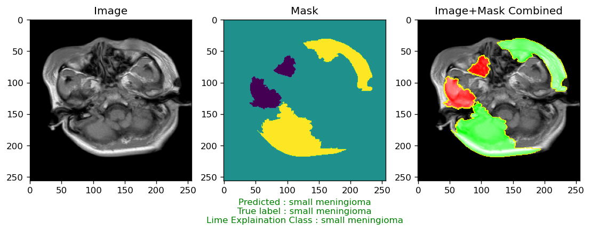
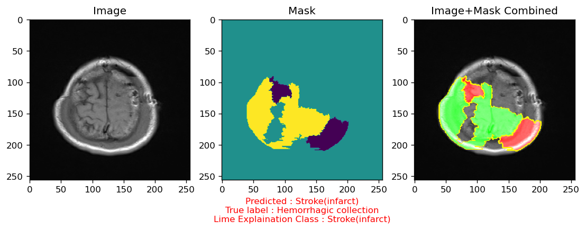
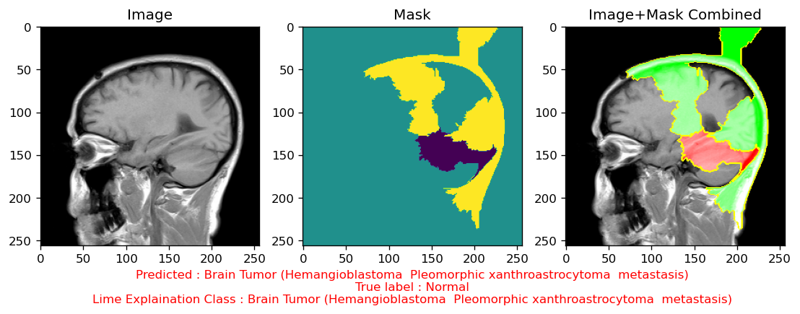

# Advanced CNN and Explainable AI Based Architecture for Interpretable Brain MRI Analysis

## Abstract
Convolutional Neural Networks (CNNs) serve as a foundational component in the domain of Computer Vision (CV). In order to enhance the Interpretability of CNN models, a critical aspect for clinical adoption, this study incorporates Explainable AI (XAI) methodologies. Through applying CNNs and XAI to a dataset comprising 5285 Brain MRI 
Images, a classification accuracy of 86\% was achieved. The LIME framework was employed to generate localized explanations, thereby augmenting the model's transparency and facilitating a deeper understanding of its decision-making process. This research explores the potential of synergistically integrating deep learning and XAI to foster the development of more reliable and comprehensible medical image analysis systems. Such systems hold the promise of improving diagnostic accuracy and clinical decision-making by providing healthcare professionals with transparent and explainable insights into the model's predictions, ultimately leading to more informed and effective patient care.

## Table of Contents
- [Dataset](#dataset)
- [Proposed Methodology](#proposed-methodology)
- [Experimental Setups](#experimental-setups)
- [Results](#results)
- [Explainable AI](#explainable-ai)
- [Contact Information](#contact-information)
- [Citation](#citation)
- [License](#license)

## Dataset

The dataset used for training and evaluation is "Brain MRI Dataset" available on Figshare. You can find the dataset <a href="https://figshare.com/articles/dataset/Brain_MRI_Dataset/14778750/2">here</a>.

## Proposed Methodology

## Experimental Setups
    
### Anaconda with VSCode
- **Environment:**
  - Python Version: 3.6.13 
  - Tensforflow Version: 2.6.2
  - Keras Version: 2.6.0
  - Processor: Intel i5 13400F
  - GPU: NVIDIA GeForce RTX 3060 (12 GB)
  - RAM: 16 GB
  - Storage: 512 GB NVMe SSD + 1 TB HDD
    

## Results
### Performance Evaluation of CNN Classification Model for Brain MRI Dataset

| Model | Accuracy | Precision | Recall | F1 Score |
|-------|----------|-----------|--------|----------|
| CNN   |   0.86   |   0.92    |  0.81  |   0.85   |

## Explainable AI
- **Correctly Classified:**

- **Misclassified:**

## Contact Information

For any questions or further inquiries, please feel free to reach out:

- **Shuvashis Sarkar**
  - Email: [shuvashisofficial@gmail.com](mailto:shuvashisofficial@gmail.com)

- **Shamim Rahim Refat**
  - Email: [n.a.refat2000@gmail.com](mailto:n.a.refat2000@gmail.com)

- **Faika Fairuj Preotee**
  - Email: [faikafairuj2001@gmail.com](mailto:faikafairuj2001@gmail.com)
  
- **Tashreef Muhammad**
  - Email: [tashreef.muhammad@gmail.com](mailto:tashreef.muhammad@gmail.com)
    
## Citation

If you find the research work helpful, please consider citing our paper:

## License
[MIT License](LICENSE)
